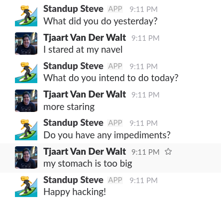
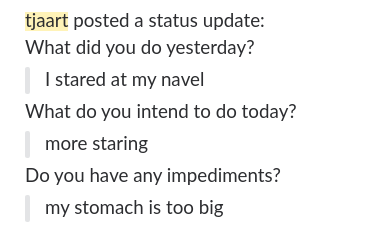

## Basic usage ##

Standup Steve direct message each standup participant, with the standup questions:

Once the participant responds to the questions, her answers gets posted to the standup channel for all to see, and comment on.

## Users ##

Currently, users need to be manually configured. Hopefully in future releases, users will be added to the standup by adding them to the slack channel.

~~~yml
users:
  - user1
  - user2
~~~

## Time and date ##

Standups are intended to be held at regular intervals. To achieve maximum flexibility, while still maintaining this regularity, Standup Steve allows configuration of:

- Days of the week (`1=Monday`, `6=Saturday`)
- Time of day 

~~~yml
standup:
  days:
    - 1
    - 2
    - 3
    - 4
    - 5
  time: 08:00
~~~

## Timeout ##

Standup Steve cancels a user's standup if he does not respond within `standup.timeout` seconds. In this case:

- The user receives a message that his standup was canceled.
- Standup Steve posts to the channel, that the user missed the standup.

~~~yml
standup:
  timeout: 3600
~~~

## Debug mode ##

In `debug` mode a new standup is called every 2 minutes, and `timeout` is set to 1 minute.
It also prints some debug information useful for development.
~~~yml
debug: true
~~~
