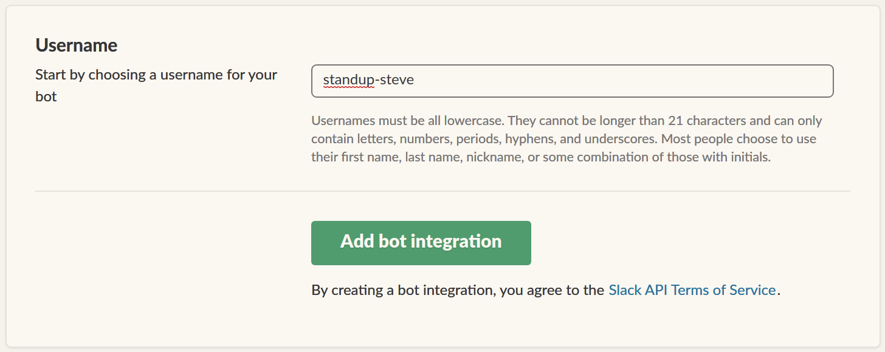
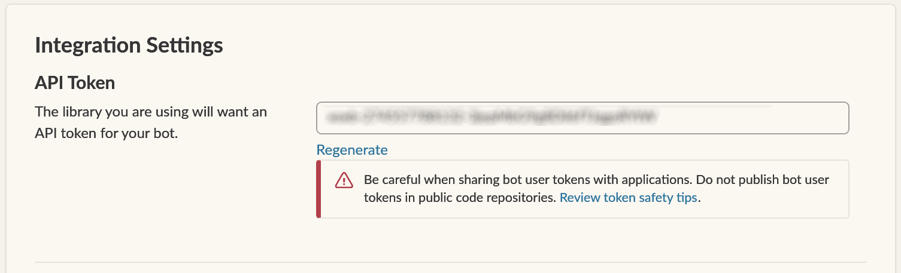
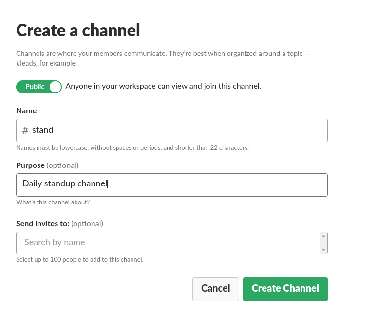

## Create a Slack Bot ##

To use Standup Steve, you need to manually create a Slack Bot. In your browser, go to <https://my.slack.com/services/new/bot>

Set your bot name

Copy the generated API token, into the `token` section of your configuration file.

## Create a public Slack Channel ##

Create a public Slack Channel, with the same name specified in the `bot.channel` section of your configuration file

**NB:** This channel should be **public**, private channels are currently unsupported!

